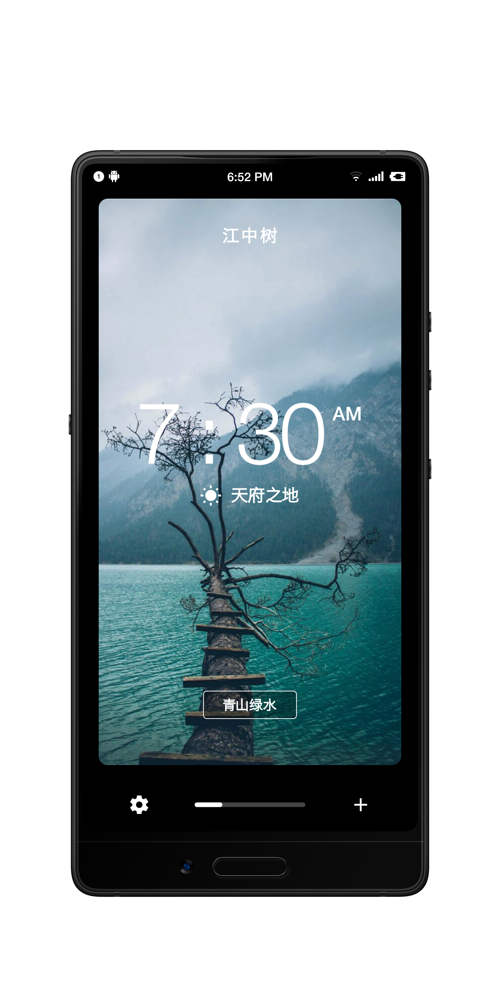
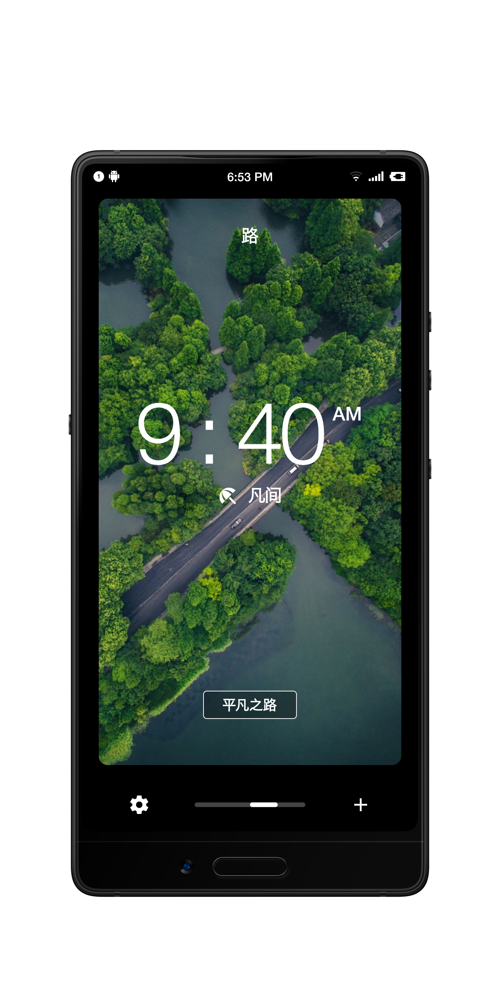

# card_flip

Flutter 实现的页面轮播效果，模仿这个[设计稿](https://dribbble.com/shots/2383984-Billabong-Surf-App-Teaser)来的。

我是根据Youtube上的[这个教程](https://www.youtube.com/watch?v=sWkysCKh2uY&t=4473s)做的，效果非常好。

由于官方教程没有开源代码，我就跟着教程，把代码写了下来，方便大家学习。然后我也根据自己的理解，试着讲解一下。

讲解在：[这里](https://zhuanlan.zhihu.com/p/42374504)

## 效果

动画主要分三部分，第一是页面滑动，第二是文字滑动快于图片，第三是底部的滑动条。

APP已经编译好，放在apk目录下了，也可以点此[下载APK](./apk/card_flip.apk)

下面是效果图

